# Buynora Backend Architecture - Phase 1 Foundation

This document outlines the architecture, layout, design standards, and infrastructural patterns established for the Buynora enterprise e-commerce platform.

---

## 1. System Topology

Buynora is built as a cloud-native, decentralized microservice platform utilizing Spring Cloud components for registration, routing, and centralized configuration.

```mermaid
graph TD
    Client["Client / Web Front-end"] -->|HTTP/REST| GW["API Gateway (Port 8080)"]
    
    subgraph Infrastructure ["Core Platform Infrastructure"]
        GW -->|Routes requests| Discovery["Eureka Service Registry (Port 8761)"]
        Config["Spring Cloud Config Server (Port 8888)"]
    end
    
    subgraph Auth_Domain ["Identity & Security"]
        GW -->|/api/v1/auth/*| Auth["Authentication Service (Port 8081)"]
        GW -->|/api/v1/users/*| User["User Service (Port 8082)"]
    end

    subgraph Product_Domain ["Catalog & Inventory"]
        GW -->|/api/v1/products/*| Product["Product Service (Port 8085)"]
        GW -->|/api/v1/categories/*| Category["Category Service (Port 8086)"]
        GW -->|/api/v1/brands/*| Brand["Brand Service (Port 8087)"]
        GW -->|/api/v1/inventory/*| Inventory["Inventory Service (Port 8088)"]
    end

    subgraph Order_Domain ["Checkout & Fulfilment"]
        GW -->|/api/v1/cart/*| Cart["Cart Service (Port 8089)"]
        GW -->|/api/v1/wishlist/*| Wishlist["Wishlist Service (Port 8090)"]
        GW -->|/api/v1/orders/*| Order["Order Service (Port 8091)"]
        GW -->|/api/v1/payments/*| Payment["Payment Service (Port 8092)"]
    end

    subgraph Marketing_Domain ["Engagement & Analytics"]
        GW -->|/api/v1/coupons/*| Coupon["Coupon Service (Port 8093)"]
        GW -->|/api/v1/offers/*| Offer["Offer Service (Port 8094)"]
        GW -->|/api/v1/reviews/*| Review["Review Service (Port 8095)"]
        GW -->|/api/v1/notifications/*| Notification["Notification Service (Port 8096)"]
    end

    subgraph Search_Domain ["Search & Discovery"]
        GW -->|/api/v1/search/*| Search["Search Service (Port 8097)"]
        GW -->|/api/v1/recommendations/*| Recs["Recommendation Service (Port 8098)"]
    end

    subgraph Operations_Domain ["Operations"]
        GW -->|/api/v1/sellers/*| Seller["Seller Service (Port 8083)"]
        GW -->|/api/v1/admin/*| Admin["Admin Service (Port 8084)"]
        GW -->|/api/v1/campaigns/*| Campaign["Campaign Service (Port 8099)"]
        GW -->|/api/v1/delivery/*| Delivery["Delivery Service (Port 8100)"]
        GW -->|/api/v1/media/*| Media["Media Service (Port 8101)"]
        GW -->|/api/v1/analytics/*| Analytics["Analytics Service (Port 8102)"]
        GW -->|/api/v1/support/*| Support["Support Service (Port 8103)"]
    end

    classDef infra fill:#2b303c,stroke:#4b505c,color:#fff;
    classDef domain fill:#1f2833,stroke:#66fcf1,color:#fff;
    class GW,Discovery,Config infra;
    class Auth,User,Product,Category,Brand,Inventory,Cart,Wishlist,Order,Payment,Coupon,Offer,Review,Notification,Search,Recs,Seller,Admin,Campaign,Delivery,Media,Analytics,Support domain;
```

---

## 2. Infrastructure Services

### 2.1 Eureka Discovery Server (`eureka-server` - Port 8761)
- Serves as the central registry for all microservices instances.
- Allows client-side load balancing and abstract routing.
- Configured with peer replication capability disabled for standalone development mode, but expandable.

### 2.2 Config Server (`config-server` - Port 8888)
- Centralizes application properties in a single repository.
- Uses standard native classpath filesystem mapping for bootstrapping.
- Configured to broadcast updates via Spring Cloud Bus in future iterations.

### 2.3 API Gateway (`gateway` - Port 8080)
- Single entry point for external traffic.
- Rewrites internal route configurations and forwards requests based on path matching.
- Auto-registers with Eureka to perform load-balanced routing to downstream microservices using their application IDs.

---

## 3. Microservice Structure & Coding Standards

All business microservices follow standard Spring Boot development practices:

- **Java 21 Virtual Threads**: Supported out-of-the-box in Spring Boot 3.x, enabling massive concurrent user capacity under blocking operations.
- **Lombok**: Minimizes boilerplate by generating constructors, builders, getters, and setters.
- **MapStruct**: Compiles high-performance, type-safe mapping code between Data Transfer Objects (DTOs) and Domain Entities.
- **Spring Validation**: Validates user inputs standardizing JSR-380 validation annotations (`@NotNull`, `@Size`, `@Email`, etc.) on DTO layers.
- **Spring Boot Actuator**: Provides endpoints (`/actuator/health`, `/actuator/metrics`) ready for Prometheus and Grafana monitoring.
- **OpenAPI 3.0**: Exposes Swagger UI endpoint (`/swagger-ui/index.html`) on every service for automated API exploration and testing.
- **Global Error Handling**: Managed by importing `common-library` which provides a centralized `@RestControllerAdvice` ensuring all APIs return standardized error formats under failure conditions.
